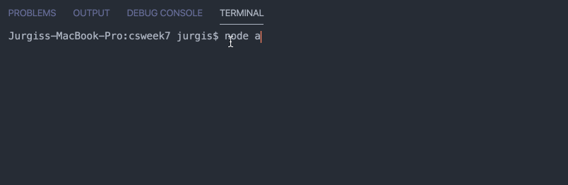

# Command Line Interface (CLI) todo app with Node.js
## Demo of some of the features

### Add a new task and list all tasks

### Delete by Status

### Delete by ID

## Features
* User can create a todo with content
* When a todo is created, it has a "status" field, which is by default set to false
* User can list all todos, displaying their status and content, by issuing a list command
* User can list all todos that are complete or incomplete, by issuing a list status=true or list status=false command. 
* User can delete a specific todo by issuing a delete <id> command
* User can toggle the status of a todo done by issuing aa toggle <id> command
* User can delete all todos by issuing a delete_all command
* Text messages printed in custom style for readability (different color or styles)
